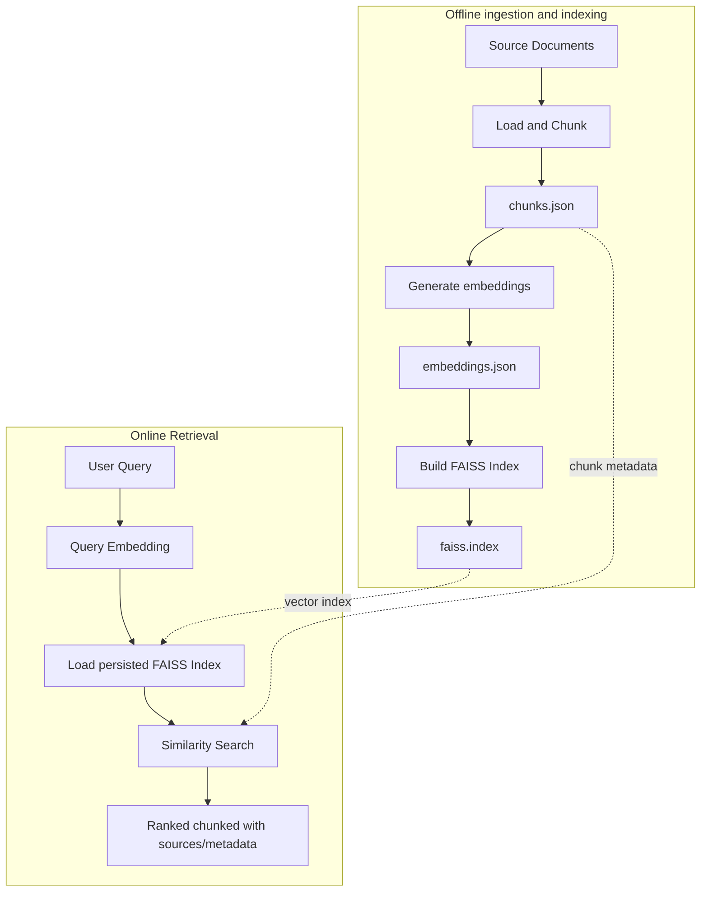

## A semantic RAG Engine for technical documents

An evaluation driven semantic retrieval enginee for building grounded question-answering systems over technical documents.

This project converts the source documents into traceable text chunks, generates dense embeddings, builds a persistent FAISS index, and retrieves the semantically relevant context chunks for a given user query.

The quality of the retrieved chunks is measured using:
1. **Recall@K**
2. **Mean Reciprocal Rank**

so that changes to chunking, embedding, and ranking behaviour can be evaluated rather than be judged by manual examples.

The main goal of this project is to provide a reliable retrieval layer for a production grade RAG system. One that improves the access to the technical knowledge while reducing unsupported or stale LLM responses.

### Why this project?
Keyword search depends on exact working and a document that may contain the right information can be missed when a user expressesthe same idea with different terminology. In that case when the keywords from the user query does not match the keywords in the document, the retrieval fails to work. Now, the large language models (LLM) can although generate fluent answers, they can't be fed the entire set of documents to recieve the answers.

So then this project addresses the gap using the following practices:
1. retrieving context by **semantic similarity** rather than looking for exact keyword matching
2. capturing and persisting source metadata and character offsets for traceability
3. seperating the process of offline ingestion and indexing from online user query
4. persisting the vector index instead of rebuilding it for every query
5. measuring the retrieval quality using Recall@K and MRR ranking metrics
6. validating the process and behaviour using automatated tests and CLI

### System Architecture

### Artifacts
- The ingestion pipeline produces 3 related artifacts:
1. **chunks.json** - chunk text, IDs, source metadata, and character offsets;
2. **embeddings.json** - vector representations aligned with chunk records (currently position based alignmentg)
3. **faiss.index** - the vector index (searcheable) used by query path.

### Retrieval Evaluation
#### Recall@K
In simple terms, it measures how much of labeled retrieved chunk/evidence appears in the first `K` retrieved results. Its useful for tuning the context being passed to downstream, and also identifying relevant chunks that were excluded from the overall candidate set.

#### Mean Reciprocal Rank (MRR)
And MRR simply measures how early the first relevant/expected chunk appears in the ranked results. So if there is a relevant chunk at rank 1, then it receives a reciprocal rank of `1.0`, if its at rank 2, then `0.50`, if 3, then `0.33` and so on.
In simple terms,
` When the retriever finds the relevant chunk; how highly does it rank it?`

**PS**: 
_Recall@K measures coverage_ 
_MRR measures ranking quality_

### Delivery Status

#### Phase 1 — Retrieval Foundation

- [x] Document loading
- [x] Source-aware text chunking
- [x] Character-level source offsets
- [x] Embedding generation
- [x] FAISS vector search
- [x] Retriever abstraction
- [x] Persisted chunks and embeddings
- [x] Persisted FAISS index
- [x] Separation of ingestion and query execution

#### Phase 2 — Retrieval Evaluation
- [x] Labeled evaluation questions
- [x] Expected relevant chunk IDs
- [x] Recall@K
- [x] Reciprocal rank per question
- [x] Mean Reciprocal Rank
- [x] Automated tests for retrieval and evaluation behavior

### Upcoming Phases
These are the following phases I will be adding next, will add more information as I move forward with the developments:

#### Phase 3 - Grounded Answer Generation
- [ ] TBA
#### Phase 4 - Service and Reliability Engineering
- [ ] TBA
#### Phase 5 - Scale, Security, and Retrieval Quality
- [ ] TBA

### Technology Stack
- **Language**: Python 3.11
- **Embeddings**: Sentence Transformers
- **Vector Index**: FAISS
- **Testing**: pytest
- **Linting and formatting**: Ruff
- **Packaging**: pyproject.toml
- **Continuous Integration**: Githunb Actions
- **Generation Layer**: provider-agnostic LLM integration and grounded prompt orchestration
- **Service Layer**: FastAPI and Pydantic
- **Operations**: Docker, Structured Logging, Monitoring and Performance Benchmarking
- **Retrieval Extensions**: Hybrid Search, Metadata filtering, and reranking

### Updates
#### Current Value
Right now, the project has moved from a simple notebook-style RAG prototype to a inspectable retrieval system with explicit data artifacts, measurable ranking behaviour, source traceability and automated quality checks. This project now sets a simple POC for experimenting with chunking and retrieval strategies.
